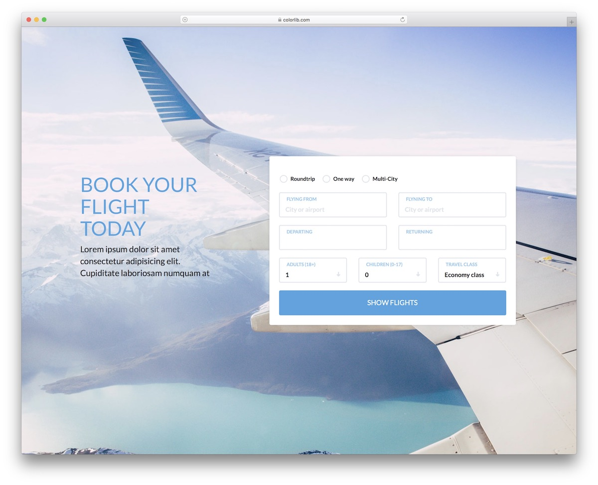

# Hello Scalar! Bye, Swagger 👋🏼
This .NET package Scalar.AspNetCore provides an easy way to render beautiful API references based on OpenAPI/Swagger documents.

Made possible by the wonderful work of @captainsafia on building the integration and docs written for the Scalar & .NET integration. Thanks to @xC0dex for making it awesome.
Scalar is a tool that helps us create beautiful documentation for our APIs. Unlike the default Swagger documentation, which can feel a bit outdated, Scalar offers a fresh and modern UI for API documentation. Its clean design makes it easy for developers to find the APIs they need for testing.

# CLean architecture
Clean architecture is a software design philosophy that separates the elements of a design into ring levels. An important goal of clean architecture is to provide developers with a way to organize code in such a way that it encapsulates the business logic but keeps it separate from the delivery mechanism. 

# Angular 19
Welcome to Angular 19! This latest release brings a wealth of new features and enhancements designed to streamline development and improve performance. From innovative reactive primitives like linkedSignal and the resource API to experimental Incremental Hydration and enhancements in Angular Language Service, Angular 19 is packed with tools to make your applications faster and more efficient. Dive into our comprehensive overview to discover all the exciting updates and learn how they can elevate your projects to the next level.

# 💻 Tech:
   

<picture>
  <source media="(prefers-color-scheme: dark)" srcset="https://raw.githubusercontent.com/tobiasmeyhoefer/tobiasmeyhoefer/output/github-snake-dark.svg" />
  <source media="(prefers-color-scheme: light)" srcset="https://raw.githubusercontent.com/tobiasmeyhoefer/tobiasmeyhoefer/output/github-snake.svg" />
  
</picture>
